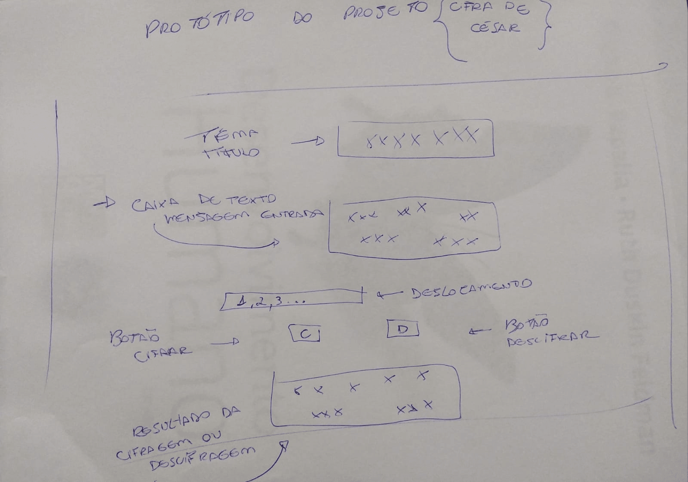

# Devicifrando  

## 1. Prefácio

Cifrar significa codificar. A [cifra de César](https://pt.wikipedia.org/wiki/Cifra_de_C%C3%A9sar)
é um dos primeiros tipos de criptografias conhecidas na história.
O imperador romano Júlio César utilizava essa cifra para enviar
ordens secretas aos seus generais no campo de batalha.

A cifra de César é uma das técnicas mais simples de cifrar uma mensagem. É um
tipo de cifra por substituição, em que cada letra do texto original é
substituida por outra que se encontra há um número fixo de posições
(deslocamento) mais a frente do mesmo alfabeto.

Por exemplo se usarmos o deslocamento (_offset_) de 3 posições:

* Alfabeto sem cifrar: A B C D E F G H I J K L M N O P Q R S T U V W X Y Z
* Alfabeto com cifra:  D E F G H I J K L M N O P Q R S T U V W X Y Z A B C
* A letra A será D
* A palavra CASA será FDVD

Atualmente todas as cifras de substituição alfabética simples, são decifradas
com facilidade e não oferecem muita segurança na comunicação por si mesma,
mas a cifra de César muitas vezes pode fazer parte de um sistema
mais complexo de criptografia, como
a cifra de Vigenère, e tem aplicação no sistema ROT13.

## 2. Resumo do projeto

Meu projeto Devcifrando, foi desenvolvido durante o período de Bootcamp na qual faço parte, pela Organização Laboratória Brasil - Turma SAP008.

O projeto tem como objetivo, criar um espaço, onde o usuário consiga Cifrar e Descifrar suas mensagens de texto. Para sua criação, foram utilizadas as aplicações de HTML, CSS e Linguagem JavaScript. A lógica do projeto teve como base o sistema de cifragem da Cifra de César, possibilitando que o usuário cifre ou decifre um texto indicando uma chave de deslocamento. Baseou-se no protótipo de baixa fidelidade desenhado abaixo:

Meu tema foi baseado nos indecifraveis códigos verdes de Matrix. Desenvolvi o projeto, com o objetivo de conseguirmos Codificar e Descodificar nossas mensagens, por esse sistema senciente. 

## 3. Interface do Usuário

A interface do meu projeto foi pensada com o objetivo de o usuário conseguir:

- Inserir uma mensagem de texto que para cifrar ou descifrar, de acordo com a tabela ASCII;
- Escolher um número que indicará quantas posições ele deseja deslocar para que ocorra a cifragem e/ou descifragem da mensagem;
- Visualizar o retorno da mensagem cifrada e/ou descifrada ao apertar o botão de cifrar/descifrar.

## 4. Estrutura e organização dos arquivos

Estruturei a aplicação web dá seguinte forma:

No arquivo index.html  está todo o código estrutural da página web;
No style.css está o código de estilização da página web;
No cipher.js está a lógica do código para tealização da cifragem e da decifragem;
No index.js está a lógica do código de manipulação do DOM com interação do usuário na página.

## 5. Ferramentas utilizadas no projeto
 
- Visual Studio Code;
- Trello;
- Git.
